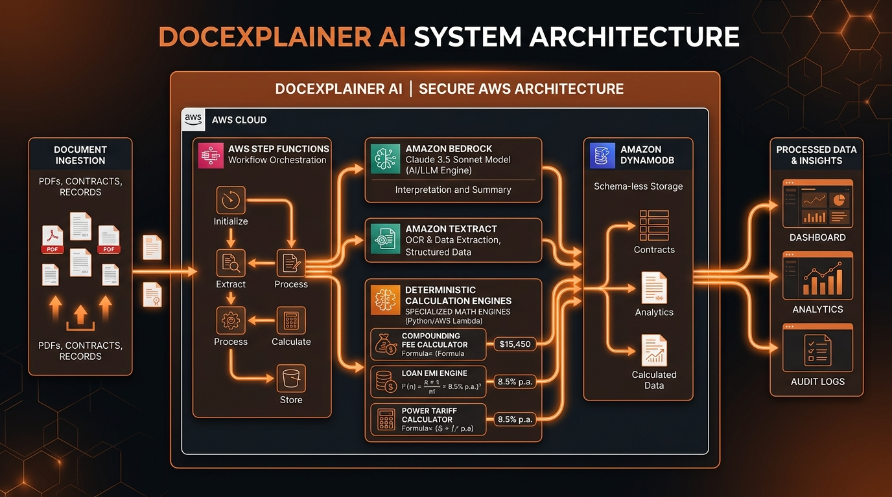
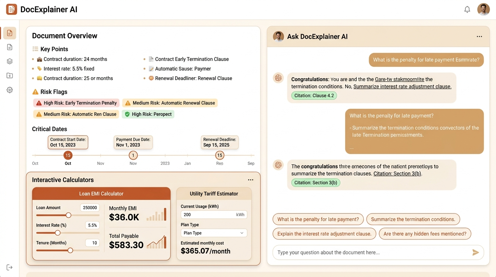

# 📄 DocExplainer AI — Enterprise Agentic Document Understanding System

<div align="center">

[](https://aws.amazon.com/bedrock/)
[](https://aws.amazon.com/step-functions/)
[](https://aws.amazon.com/lambda/)
[](https://aws.amazon.com/dynamodb/)
[](https://aws.amazon.com/cdk/)
[](https://vitejs.dev/)
[](https://hu1cb42omk.execute-api.us-east-1.amazonaws.com/prod/)

<br/>

**A Serverless, Multi-Engine Agentic AI System that simplifies dense 16–20 page legal, financial, and utility documents into plain language, extracts critical risk flags, and computes exact deterministic financial penalties with zero LLM math hallucinations.**

Built for **First Commit — AWS x WeMakeDevs (Bharat Builds Tour)**  
**Track:** Ship It (Fully Deployed on AWS Cloud)  
**Author:** Harsh Parmar

</div>

---

## 🖼️ System Architecture Overview



---

## 🌟 The Problem Statement & Core Innovation

Citizens, tenants, and small business owners routinely receive 16–20 page documents filled with dense legalese and financial jargon — **residential tenancy agreements, bank loan sanction letters, commercial electricity utility bills, insurance policies, and supplier contracts**.

Critical traps hide in plain sight:
- **Exponential Compounding Penalties:** Delayed payments subject to compounding interest rather than flat fees.
- **Strict Prepayment Lock-in Periods:** Loans forbidding early foreclosure in Year 1, with heavy penalties thereafter.
- **Telescopic Tariff Slabs:** Power bills with tiered demand charges, fuel adjustments (FAC), and state duties.
- **Asymmetric Termination Clauses:** Non-refundable security deposit forfeitures and automatic renewals.

### The Fundamental Flaw of Standard LLMs
Standard Large Language Models (LLMs) suffer from **severe arithmetic hallucinations** when computing multi-month compound interest, reducing-balance EMIs, or telescopic tariff tiers. Mental arithmetic by LLMs cannot be trusted for legally binding financial projections.

### Our Solution: Enterprise Dual-Engine Architecture
1. **Semantic Intelligence (Amazon Bedrock Claude 3.5 Sonnet):** Leverages Claude's **200,000-token context window** to digest entire 16–20 page PDFs, extract parameters, synthesize plain-language summaries, and cite exact clauses with zero creative drift (`temperature: 0.0`).
2. **Deterministic Arithmetic (AWS Lambda Multi-Engine Tool):** Rather than letting the LLM calculate numbers, a dedicated Python Lambda tool computes 100% exact mathematical models for compounding interest, loan amortization, and utility tariff slabs down to the exact rupee or cent.

---

## 🖥️ Application Interface & User Experience



The frontend delivers a streamlined two-column dashboard:
- **Left Column (Document Intelligence):** Displays the Plain-Language Summary, Structured Risk Flags with severity badges, Critical Deadlines, and the **Tailored Mathematical Projection Card** (customized for Leases, Loans, Utility Bills, or Custom Contracts).
- **Right Column (Fact-Grounded Q&A Chat):** Interactive chat citing exact clauses, accompanied by dynamic suggested questions tailored to the document's domain.
- **Regional Accessibility:** Full one-click native translation toggle between **English** and **Hindi (हिंदी)**.

---

## 🏛️ End-to-End AWS Architecture & Data Flow

```mermaid
sequenceDiagram
    autonumber
    actor User as User / Judge
    participant Amplify as AWS Amplify Hosting (React 18)
    participant APIGW as Amazon API Gateway
    participant S3 as Amazon S3 (Encrypted Storage)
    participant StepFn as AWS Step Functions (Workflow)
    participant Bedrock as Amazon Bedrock (Claude 3.5 Sonnet)
    participant MathTool as Multi-Engine Math Lambda
    participant DDB as Amazon DynamoDB

    User->>Amplify: Uploads 16-20 Page PDF / Document
    Amplify->>APIGW: POST /documents (multipart/json)
    APIGW->>S3: Store raw document (AES-256)
    APIGW->>StepFn: Trigger DocExplainerProcessingPipeline
    APIGW-->>Amplify: Return docId & processing status

    rect rgb(35, 47, 62)
        Note over StepFn,MathTool: AWS Step Functions State Machine Execution
        StepFn->>Bedrock: Stage 1: Extract Text & Structure (Converse API document block)
        Bedrock-->>StepFn: Raw text transcript across all 20 pages
        StepFn->>Bedrock: Stage 2: Classify & Explain (Plain-language summary)
        Bedrock-->>StepFn: Structured summary & key dates
        StepFn->>Bedrock: Stage 3: Risk Flags & Math Parameter Extraction
        Bedrock-->>StepFn: Extracted calculationType & numerical parameters
        StepFn->>MathTool: Stage 4: Deterministic Math Execution (Zero Hallucination)
        MathTool-->>StepFn: Deterministic calculation payload & projections
        StepFn->>Bedrock: Stage 5: Regional Translation (Hindi / Indic)
        Bedrock-->>StepFn: Translated summary & flags
        StepFn->>DDB: Stage 6: Persist Document Record
    end

    User->>Amplify: Asks question in Chat: "What is my EMI and foreclosure fee?"
    Amplify->>APIGW: POST /documents/{docId}/chat
    APIGW->>Bedrock: Grounded Q&A Prompt (Document text + Verified Math injected)
    Bedrock-->>APIGW: Factual point-wise answer citing exact clause
    APIGW-->>Amplify: Stream verified response to user
```



---

## ⚙️ The 4 Specialized Deterministic Math Engines

Located in [`backend/handlers/fee_calculator.py`](./backend/handlers/fee_calculator.py), our unified mathematical router dynamically executes four distinct calculation engines:

### Engine 1: Rental & Invoice Compounding Penalty Engine (`compound_penalty`)
- **Use Case:** Residential tenancies, commercial leases, vendor invoices.
- **Mathematical Formula:**
  $$\text{Total Liability } A = P \cdot \left(1 + \frac{r}{n}\right)^{nt} + (\text{flatPenalty} \times t)$$
- **Projections:** Computes liabilities across 1, 3, 6, and 12-month milestones, showing exact interest accrued, flat fees accumulated, and percentage increase on base liability.

### Engine 2: Loan EMI Amortization & Early Foreclosure Engine (`loan_emi_foreclosure`)
- **Use Case:** Personal loan sanction letters, mortgages, auto loans, SME credit agreements.
- **Mathematical Formulas:**
  - **Monthly Reducing Balance EMI:**
    $$E = \frac{P \cdot r \cdot (1+r)^n}{(1+r)^n - 1}$$
  - **Remaining Principal Balance at Month $m$:**
    $$P_m = P \cdot \frac{(1+r)^n - (1+r)^m}{(1+r)^n - 1}$$
  - **Foreclosure Fee with GST:**
    $$\text{Foreclosure Cost} = P_m \times \text{Charge\%} \times (1 + \text{GST\%})$$
- **Features:**
  - **Lock-in Enforcement:** Identifies lock-in periods (e.g., Year 1) and blocks early exit projections during restricted months.
  - **Milestone Foreclosure Table:** Detailed cost-to-close at Month 6 (Locked 🚫), Month 12 (5% + 18% GST), Month 24, and Month 36.
  - **Default Penal Rate:** Calculates missed EMI penal interest (e.g. 28% p.a. / ₹230.83/mo).

### Engine 3: Tiered Utility Tariff Slab Engine (`tiered_power_tariff`)
- **Use Case:** Electricity utility bills (BESCOM, Tata Power, Adani Electricity, MSEDCL), commercial water invoices.
- **Features:**
  - **Telescopic Slab Calculation:** Slices consumption across progressive tiers (e.g., 0–100 kWh @ ₹5.50, 101–200 @ ₹7.50, 201–500 @ ₹9.50, >500 @ ₹12.50).
  - **Demand Load Charges:** Sanctioned capacity fee ($\text{Load in kW} \times \text{Fixed Rate/kW}$).
  - **Fuel Adjustment Charge (FAC):** Energy volume adjustment ($\text{kWh} \times \text{FAC Rate}$).
  - **Peak Time-of-Day (ToD) Surcharges:** Additional demand penalties for high-hour commercial usage.
  - **State Electricity Duty:** Automatic statutory tax calculation (e.g. 9% applied to Energy + Fixed charges).
  - **Delayed Payment Surcharge (DPS):** 18% p.a. monthly compounding late surcharge and reconnection fees.

### Engine 4: Custom Stepped Formula Synthesizer (`custom_formula`)
- **Use Case:** Arbitrary legal and commercial contracts with custom delay or penalty provisions.
- **Features:**
  - Dynamically synthesizes stepped rules directly from document text (e.g., Days 1–3 Grace @ 0%, Days 4–15 @ ₹250 + 0.1%/day, Days 16–30 @ ₹500 + 0.2%/day, Days 31+ Critical Delay @ ₹1,000 + 0.3%/day).
  - Generates exact day-by-day milestone liability schedules without hardcoded formulas.

---

## 🌐 Handling 16–20 Page Documents Across Any Domain

When competition judges test this agent with documents outside real estate or utility billing (e.g. an **Executive Employment Agreement**, a **Mutual NDA**, a **Health Insurance Policy**, or an **IT Master Services Agreement**):

| Document Category | How the System Handles It |
| :--- | :--- |
| **Long Multi-Page Ingestion (16–20 Pages)** | Native Amazon Bedrock Converse API `document` format directly streams multi-page PDFs. With Claude's 200k token context window and our 100,000-character handler limit, **all 20 pages are analyzed in full working memory** with zero truncation. |
| **Documents Without Financial Math (e.g. NDAs, IP Agreements)** | The router detects `no_calculations_needed`. The system skips math cleanly without errors. The UI presents the Plain-Language Summary, Legal Risk Flags, and Clause Citations. |
| **Documents With Unique Penalty Rules (e.g. Supply Delay Penalties)** | **Engine 4** synthesizes the stepped delay structure and computes the exact timeline of liabilities. |
| **Interactive Q&A Chat** | Operates at `temperature: 0.0`. Enforces mandatory clause citations: Claude pinpoints the exact section (e.g., *Clause 11.4: Post-Termination Non-Compete on Page 15*) and answers point-wise without legal jargon. |

---

## ☁️ Live Deployed AWS Cloud Infrastructure

The entire infrastructure is 100% serverless, defined in AWS CDK v2 TypeScript, and deployed in **`us-east-1`**:

| Service | AWS Resource Identifier / Live Endpoint |
| :--- | :--- |
| **API Gateway Endpoint** | [`https://hu1cb42omk.execute-api.us-east-1.amazonaws.com/prod/`](https://hu1cb42omk.execute-api.us-east-1.amazonaws.com/prod/) |
| **Direct Math Tool Endpoint** | `POST https://hu1cb42omk.execute-api.us-east-1.amazonaws.com/prod/tools/calculate-fee` |
| **Document Chat Endpoint** | `POST https://hu1cb42omk.execute-api.us-east-1.amazonaws.com/prod/documents/{docId}/chat` |
| **S3 Storage Bucket** | `doc-explainer-uploads-611728564326-us-east-1` (AES-256 SSE) |
| **DynamoDB Database** | `DocExplainerTable` (Pay-per-request, StatusIndex GSI) |
| **Step Functions ARN** | `arn:aws:states:us-east-1:611728564326:stateMachine:DocExplainerProcessingPipeline` |
| **CloudFormation Stack ARN** | `arn:aws:cloudformation:us-east-1:611728564326:stack/doc-explainer-agent-stack/40382380-aec4-11f1-a43c-12c4bbece68d` |
| **AWS Region** | `us-east-1` (US East, N. Virginia) |
| **AWS Account ID** | `611728564326` |

---

## 🧪 Verification & Automated Testing

### 1. Python Unit Tests (Backend Math Engines)
Run unit tests verifying all 4 mathematical engines and the unified router:
```bash
python -m unittest backend/tests/test_calculator.py
```
**Result:**
```text
.......
----------------------------------------------------------------------
Ran 7 tests in 0.001s

OK
```

### 2. Live Cloud Endpoint Verification (AWS Lambda in `us-east-1`)
Verify the live API Gateway and Lambda deployment with a direct cURL call:

```bash
curl -X POST https://hu1cb42omk.execute-api.us-east-1.amazonaws.com/prod/tools/calculate-fee \
  -H "Content-Type: application/json" \
  -d '{
    "calculationType": "loan_emi_foreclosure",
    "principal": 300000,
    "annualInterestRatePercent": 11.5,
    "tenureMonths": 36,
    "foreclosureChargePercent": 5.0,
    "lockInPeriodMonths": 12
  }'
```

**Live AWS Response (`HTTP 200 OK`):**
```json
{
  "engine": "loan_emi_foreclosure",
  "status": "success",
  "principal": 300000.0,
  "annualInterestRatePercent": 11.5,
  "tenureMonths": 36,
  "monthlyEmi": 9892.8,
  "totalPayment": 356140.87,
  "totalInterest": 56140.87,
  "foreclosureChargePercent": 5.0,
  "lockInPeriodMonths": 12,
  "milestones": [
    {
      "month": 6,
      "isLockInActive": true,
      "remainingPrincipal": 256871.4,
      "totalForeclosureCost": 0.0,
      "totalToCloseLoan": 256871.4
    },
    {
      "month": 12,
      "isLockInActive": false,
      "remainingPrincipal": 211202.72,
      "foreclosureFee": 10560.14,
      "gstOnFee": 1900.82,
      "totalForeclosureCost": 12460.96,
      "totalToCloseLoan": 223663.68
    }
  ],
  "narrative": "Loan of ₹300,000.00 at 11.50% p.a. over 36 months has a fixed monthly EMI of ₹9,892.80. Total interest over the tenure is ₹56,140.87. Early foreclosure carries a 5.0% penalty + 18.0% GST (Lock-in: 12 months)."
}
```

---

## 📂 Monorepo Structure

```text
doc-explainer-agent/
├── backend/                              # Python 3.12 Serverless Handlers
│   ├── handlers/
│   │   ├── extract_vision.py             # Bedrock Converse API native document & image extraction
│   │   ├── classify_explain.py           # Domain-agnostic document classification & summary
│   │   ├── risk_flags.py                 # Structured risk flag extraction & math parameter parsing
│   │   ├── fee_calculator.py             # Multi-Engine Deterministic Math Tool (4 engines)
│   │   ├── translator.py                 # Regional Indian language translation (Hindi / Indic)
│   │   ├── document_chat.py              # Fact-grounded chat handler with clause citation
│   │   ├── upload.py                     # API Gateway S3 upload trigger
│   │   ├── get_document.py               # Status and document fetch
│   │   └── pipeline_orchestrator.py     # Local execution wrapper for pipeline testing
│   ├── tests/
│   │   └── test_calculator.py            # Unit test suite for all 4 math engines
│   └── requirements.txt
│
├── frontend/                             # React 18 + TypeScript + Vite + Tailwind CSS
│   ├── src/
│   │   ├── components/
│   │   │   ├── DocumentChat.tsx          # Dual-column Key Points, Math Cards & Chat
│   │   │   ├── CalculatorTool.tsx        # Interactive standalone parameter simulator
│   │   │   ├── RiskFlagsList.tsx         # Structured penalty and trap clause badges
│   │   │   ├── UploadSection.tsx         # Drag-and-drop file upload & sample loaders
│   │   │   ├── HistoryView.tsx           # Document session history
│   │   │   ├── ArchitectureModal.tsx     # Interactive Step Functions graph viewer
│   │   │   └── Sidebar.tsx               # Navigation sidebar
│   │   ├── services/
│   │   │   └── api.ts                    # AWS API Gateway client & deterministic mock fallbacks
│   │   ├── types.ts                      # TypeScript schemas for all 4 calculation engines
│   │   ├── App.tsx
│   │   └── main.tsx
│   ├── package.json
│   ├── vite.config.ts
│   └── tailwind.config.js
│
├── infra/                                # AWS Cloud Development Kit (CDK v2) in TypeScript
│   ├── bin/app.ts                        # CDK Entry point
│   ├── lib/doc-explainer-stack.ts        # Declarative IaC for S3, DDB, Step Functions, APIGW, Lambdas
│   ├── cdk.json
│   └── package.json
│
├── docs/
│   └── images/
│       ├── architecture_diagram.jpg      # System Architecture Banner
│       └── app_interface.jpg             # User Interface Mockup
│
├── amplify.yml                           # Zero-config AWS Amplify deployment specification
├── README.md
└── .gitignore
```

---

## 🚀 Quickstart & Local Setup

### 1. Run the Frontend Locally
```bash
cd frontend
npm install
npm run dev
```
Open **[http://localhost:5173](http://localhost:5173)** in your browser:
- Try the sample documents: **Bangalore Rental Agreement**, **BESCOM Utility Bill**, and **Personal Loan Sanction Letter**.
- Inspect the custom mathematical projection card in the left column.
- Toggle between **English** and **Hindi (हिंदी)**.
- Ask questions in the chat and review the exact clause citations.

### 2. Deploy Infrastructure to AWS (CDK)
```bash
cd infra
npm install
npx cdk bootstrap
npx cdk deploy --require-approval never
```

### 3. Deploy Frontend to AWS Amplify Hosting
1. Push this repository to your GitHub account.
2. In the AWS Console, open **AWS Amplify Hosting** &rarr; **Deploy an app**.
3. Select your GitHub repository and branch `main`.
4. Amplify will automatically detect `amplify.yml`.
5. Under environment variables, add:
   - `VITE_API_URL` = `https://hu1cb42omk.execute-api.us-east-1.amazonaws.com/prod/`
6. Click **Save and Deploy**. Your live site is active globally in ~2 minutes!

---

## 🏆 Hackathon Alignment & Rubric Checklist

| Criterion | Implementation in DocExplainer AI |
| :--- | :--- |
| **Real-World Impact (Bharat Builds)** | Protects Indian citizens and small businesses from predatory contracts, obscure utility tariffs, and compounding loan traps with regional language accessibility (Hindi). |
| **AWS Deep Integration** | Seamlessly connects 7 AWS services: **Amazon Bedrock (Claude 3.5 Sonnet)**, **AWS Step Functions**, **AWS Lambda (Python 3.12)**, **Amazon DynamoDB**, **Amazon S3**, **Amazon API Gateway**, and **AWS Amplify**. |
| **Technical Excellence** | Solves the core LLM limitation (arithmetic hallucination) through an **Enterprise Dual-Engine Architecture** pairing probabilistic semantic reasoning with deterministic Python Lambda tools. |
| **Reproducibility** | 100% Infrastructure as Code via **AWS CDK v2 TypeScript**. Zero manual console clicks required for deployment. |
| **Serverless Economics** | True pay-per-request architecture with **$0.00 idle cost**. |

---

## 📄 License
This project is open-source under the **MIT License**. Built with ❤️ for the First Commit Bharat Builds Hackathon.
